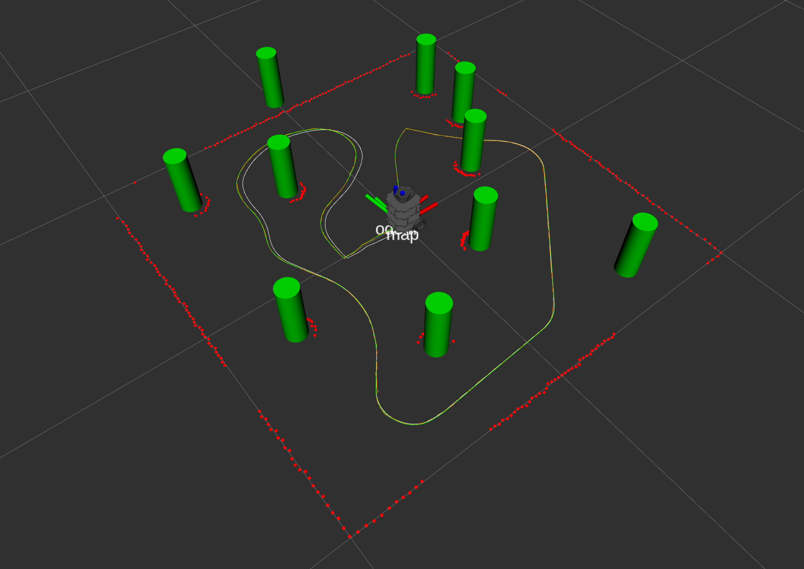

# nuslam package

This package run nodes that perform Extended Kalman Filter SLAM

# launch files

### slam.launch  

The launch file first takes an argument <b>robot</b> to specify the hostname of the turtlebot. The turtlebot machine information is specified using the <b>machine</b> tag. By using the <b>machine</b> argument in <b>node</b> tag, the node can launch on turtlebot remotely. The experiemtn results are shown in the below sections

To launch slam nodes on simulation in rviz:
```
roslaunch nuslam slam.launch robot:=localhost
```

### landmarks_detect.launch

The launch file shows landmarks detection extracted from laser scan data

To launch landmarks_detect nodes on simulation in rviz:
```
roslaunch nuslam landmarks_detect.launch simulate:=true
```
To launch landmarks_detect nodes on actual turtlebot:
```
roslaunch nuslam landmarks_detect.launch simulate:=false
```


### unknown_data_assoc.launch

The launch file perform slam with unknown data association. The nodes can be launched on turtlebot remotely. The experiemtn results are shown in the below sections

To launch unknown_data_assoc nodes on simulation in rviz:
```
roslaunch nuslam unknown_data_assoc.launch
```
To launch unknown_data_assoc nodes on actual turtlebot:
```
roslaunch nuslam unknown_data_assoc.launch robot:=<turtlebot host name>.local
```


# simulator experiment screenshots for fake sensor

In the experiment, the robot drives along closed path in a tube_world with several landmarks with the following environment parameters:
- Robot translational commanded twist noise: ~N(0, 0.01)
- Robot rotational commanded twist noise: ~N(0, 0.01)
- Robot wheel minimum slip noise: 0.9
- Robot wheel maximum slip noise: 1.1
- Sensor reading noise in x direction: 0.005
- Sensor reading noise in y direction: 0.005
- Maximum distance of the sensor reading: 0.7

Visualization Elements:
- Green tubes: Ground truth tube positions
- Red tubes: Current sensor reading for visible tubes
- Blue tubes: Current SLAM map
- Green path: Ground truth path
- White path: Odometry path
- Orange path: SLAM path

### Ground Truth Map


### Sensor Reading (Only reading tube within sensor radius)


### SLAM Map


### Compare SLAM Map to Groud Truth


### Compare paths (Ground_truth, Odom, and SLAM)


  
<br><br />
# simulator experiment screenshots for unknown data association

In the experiment, the robot drives along closed path in a tube_world with several landmarks with the following environment parameters:
- Robot translational commanded twist noise: ~N(0, 0.01)
- Robot rotational commanded twist noise: ~N(0, 0.01)
- Robot wheel minimum slip noise: 0.9
- Robot wheel maximum slip noise: 1.1
- Laser scan range noise: ~N(0,0.005)

Visualization Elements:
- Green tubes: Ground truth tube positions
- Blue tubes: Current SLAM map
- Yellow tubes: Measurement extracted from laser scan
- Green path: Ground truth path
- White path: Odometry path
- Orange path: SLAM path


### Experiment Results

Position Comparison
Path Type | x (m) | y(m) | z(m) |
--- | --- | --- | --- |
Actual | 0.0402 | 0.00288 | 0.0 |
Odom   | 0.04953 | -0.0437  | 0.0 |
Slam   | 0.04135| 0.003605 | 0.0 |

Error Percentage Comparing with Actual
Path Type | x (%) | y (%) | z (%) |
--- | --- | --- | --- |
Actual | 0.0 | 0.0 | 0.0 |
Odom   | 23.2 | 1517.6  | 0.0 |
Slam   | 2.86 | 25.2 | 0.0 |


### Ground Truth Map


### SLAM Map


### Compare SLAM Map(Blue), Groud Truth(Green), Measurement(Yellow)

