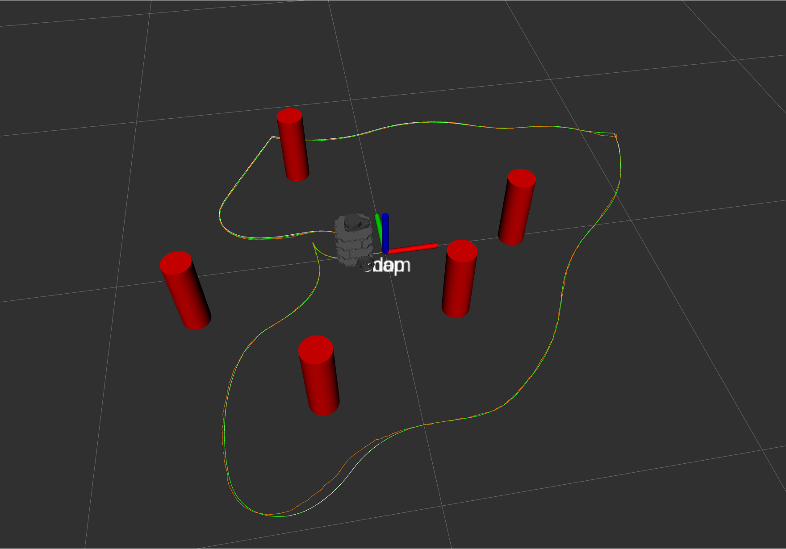
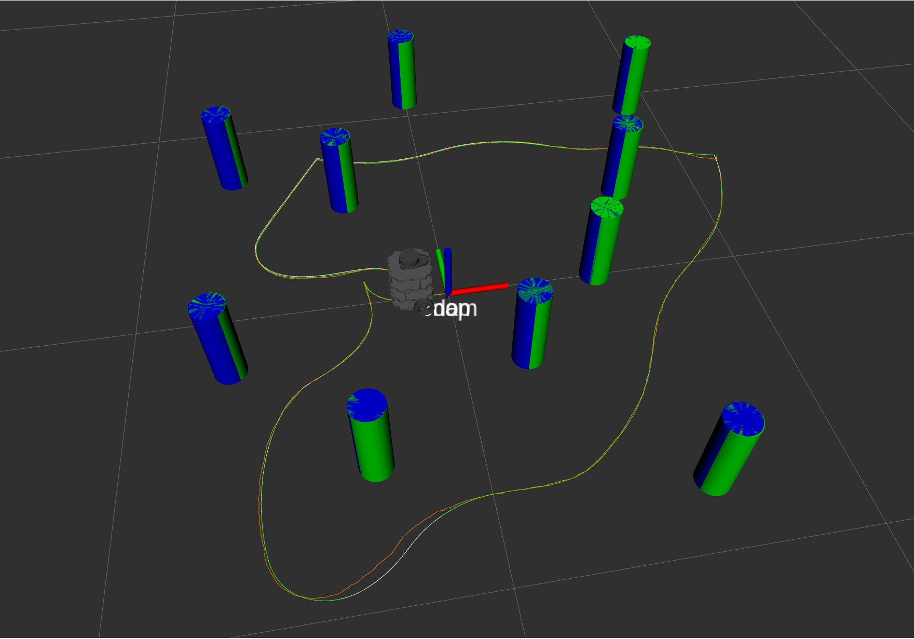

# nuslam package

This package run nodes that perform Extended Kalman Filter SLAM

# launch files

### slam.launch  

The launch file first takes an argument <b>robot</b> to specify the hostname of the turtlebot. The turtlebot machine information is specified using the <b>machine</b> tag. By using the <b>machine</b> argument in <b>node</b> tag, the node can launch on turtlebot remotely.  

To launch slam nodes on simulation in rviz:
```
roslaunch nuslam slam.launch robot:=localhost
```

# simulator experiment screenshots

In the experiment, the robot drives along closed path in a tube_world with several landmarks with the following environment parameters:
- Robot translational commanded twist noise: ~N(0, 0.01)
- Robot rotational commanded twist noise: ~N(0, 0.01)
- Robot wheel minimum slip noise: 0.9
- Robot wheel maximum slip noise: 1.1
- Sensor reading noise in x direction: 0.005
- Sensor reading noise in y direction: 0.005
- Maximum distance of the sensor reading: 0.7

Visualization Elements:
- Green tubes: Ground truth tube positions
- Red tubes: Current sensor reading for visible tubes
- Blue tubes: Current SLAM map
- Green path: Ground truth path
- White path: Odometry path
- Orange path: SLAM path

### Ground Truth Map


### Sensor Reading (Only reading tube within sensor radius)


### SLAM Map


### Compare SLAM Map to Groud Truth


### Compare paths (Ground_truth, Odom, and SLAM)

