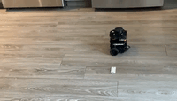
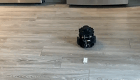
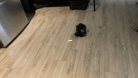
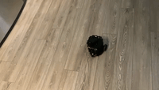

# nuturtle_robot package

This package run nodes on the turtlebot from your computer. It stores the code that interacts with the turtlebot hardware.  

# launch files

### basic_remote.launch  

The launch file first takes an argument <b>robot</b> to specify the hostname of the turtlebot. The turtlebot machine information is specified using the <b>machine</b> tag. By using the <b>machine</b> argument in <b>node</b> tag, the node can launch on turtlebot remotely.  

To launch node on my turtlebot Boba (make sure you can ping the hostname):
```
roslaunch nuturtle_robot basic_remote.launch robot:=<hostname>
```

### odom_teleop.launch

The launch file provides control to the turtlebot from remote machine. It launches nodes remotely on the turtlebot3 and on current remote PC. 

To launch node with ```turtlebot3_teleop_key``` control mode (make sure you can ping the hostname):  
```
roslaunch nuturtle_robot odom_teleop.launch robot:=boba.local
```
 
To launch node with ```follow_circle``` control mode (make sure you can ping the hostname):  
```
roslaunch nuturtle_robot odom_teleop.launch robot:=boba.local circle:=true
```


# Physical Experiment (Task F.008)

### Drive the robot forward and backward in a straight line

```
Final location: (0.0003, 0.0002, 0.0)
```

Video: https://youtu.be/sd1qR_T_WwQ  

<br></br>
 
### Rotate the robot clockwise and counter clockwise

```
Final location: (0.003, -0.0005, 0.0)
```

Video: https://youtu.be/vGaYTb6V9do  

<br></br>
  
### Drive the robot in a circle, clockwise and counter clockwise

```
Linear speed = 0.03
Circle radius = 0.2
Final location: (0.0198, -0.00066, 0.0)
```

Video: https://youtu.be/70wXSg3KgK4  

<br></br>
  
### Try one of the previous experiments again. Drive the robot in a circle, clockwise and counter clockwise

```
Linear speed = 0.17
Circle radius = 0.25
Final location: (-0.1058, 0.0165, 0.0)
```

<b>Answer:</b> It made different. The result became significantly worse. I increased the moving speed by more than 5 times and increased the radius of the circle slightly by 0.05.

Video: https://youtu.be/nbap-o6Ijz0  



